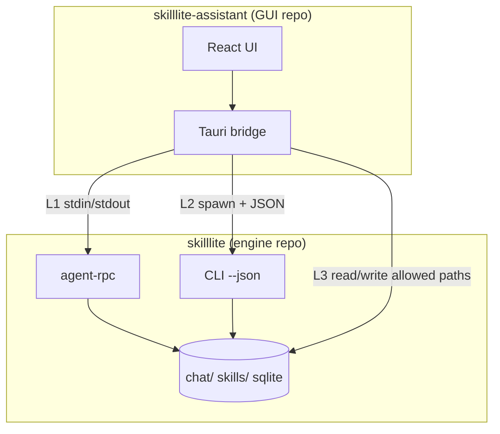

# SkillLite Assistant — split-ready architecture

> **Status:** Target architecture and migration plan (2026-05). Describes how `skilllite-assistant` can live in a **separate repository** while `skilllite` remains the **engine** (sandbox, MCP, CLI, evolution).
>
> **Related:** [Entry points — Desktop](./ENTRYPOINTS-AND-DOMAINS.md#4-desktop-skilllite-assistant) · [Architecture](./ARCHITECTURE.md) · [Pick your path — Desktop (optional)](./START_PATHS.md#path-1-desktop)

---

## 1. Goals and non-goals

### Goals

| Goal | Rationale |
|------|-----------|
| **Independent release cadence** | Desktop installers (dmg/msi/AppImage) vs `pip`/CLI on PyPI/GitHub Releases. |
| **Clear product boundary** | Engine = sandbox + MCP + `skilllite` binary; Assistant = optional GUI distribution. |
| **Single engine contract** | Assistant talks to a **released** `skilllite` binary, not path-deps on `skilllite-agent` / `skilllite-evolution`. |
| **Preserve UX** | Streaming chat, execution confirmations, evolution panel, Life Pulse, IDE layout — no feature regression at split time. |

### Non-goals

- Replacing `agent-rpc` with a terminal parser of `skilllite chat` output.
- Embedding the full agent loop inside Tauri (duplicates engine, blocks split).
- Making Assistant a second “first-class engine entry” with its own sandbox/evolution code paths.

---

## 2. Current vs target (summary)

```text
TODAY (monorepo, hybrid)
────────────────────────
skilllite-assistant (Tauri)
  ├─ agent-rpc subprocess     ← chat (good)
  ├─ skilllite CLI subprocess ← gateway, some skills, Life Pulse evolution run
  └─ in-process Rust crates   ← evolution UI, followup LLM, runtime provision,
                                 skill discovery, prompts FS  (blocks clean split)

TARGET (split-ready)
────────────────────
skilllite-assistant repo
  ├─ UI: React + Tauri commands
  └─ Bridge: subprocess-only → skilllite binary (semver-pinned)

skilllite repo (engine)
  ├─ skilllite / skilllite-sandbox / MCP
  └─ Stable machine APIs: agent-rpc + CLI --json (+ optional desktop-api)
```

---

## 3. Layered integration model

Assistant should use **three integration layers** only. Higher layers are preferred when they exist.

| Layer | Mechanism | Use for |
|-------|-----------|---------|
| **L1 — Streaming RPC** | `skilllite agent-rpc` (JSON-Lines) | `agent_chat`, confirm/clarify, streaming tool events, multimodal images |
| **L2 — CLI JSON** | `skilllite <subcommand> --json` (stdout) | Evolution status/backlog/pending, runtime probe/provision, skill list, gateway-adjacent ops |
| **L3 — Files & env** | Workspace `.env`, `chat/`, `skills/` on disk | Prompts diff UI, transcript paths; **read-only** in Assistant where possible |



**Rule:** No `path = "../../skilllite-*"` in Assistant’s `Cargo.toml` at target state.

---

## 4. Current in-process map (migration backlog)

| Area | Location (today) | Target |
|------|------------------|--------|
| Main chat | `skilllite_bridge/chat.rs` → `agent-rpc` | **Keep L1** |
| Stop chat / confirm | same + `protocol.rs` | **Keep L1** |
| Evolution status panel | `integrations/evolution_ui/status.rs` | **L2** `skilllite evolution status --json` (**shipped**) |
| Evolution backlog / pending | `backlog.rs`, `pending.rs` | **L2** `backlog --json --hide-closed`, `pending --json`, `proposal-status --json`, `confirm`/`reject --json` (**shipped**) |
| Manual evolution trigger | `trigger.rs` | **L2** `skilllite evolution run --json --log-manual-trigger` (**shipped**) |
| Life Pulse `growth_due` | `growth.rs` + `life_pulse.rs` | **L2** status JSON (cache 30s); keep subprocess for `evolution run` |
| Follow-up chips | `followup_suggestions.rs` | **L2** `skilllite suggest-followup --json` (**shipped**) |
| Runtime install UI | `desktop_services.rs` | **L2** `runtime probe/provision --json` (**shipped**; CLI first + in-process fallback) |
| Skill list / add | `skill_rpc.rs` + partial `core` | **L2** `skills list --json` (**shipped** for list); add/repair still CLI subprocess |
| Prompts diff / write | `prompt_artifact.rs` + `skilllite-fs` | **L3** read snapshots via CLI; writes via allowlisted paths + `skilllite` or narrow FS helper |
| Bundled skills sync | `bundled_skills_sync.rs` | **L2** `skilllite skills sync-bundled` (or keep copy-only in Assistant resources) |
| Gateway manager | `gateway_manager.rs` | **L2** spawn `skilllite gateway serve` (already subprocess) |

---

## 5. Engine contracts (define before extract)

### 5.1 L1 — `agent-rpc` (frozen baseline)

Already documented in `crates/skilllite-agent/src/rpc.rs`. Assistant depends on:

- Methods: `agent_chat`, `confirm`, `clarify`, `ping`
- Events: `text_chunk`, `tool_call`, `confirmation_request`, `done`, `error`, …

**Versioning:** Treat breaking changes to line protocol as **engine major** bump; Assistant declares `min_skilllite_version`.

### 5.2 L2 — CLI JSON surface (to add / extend)

Priority commands for parity with today’s Desktop bridge:

| Command | JSON output | Notes |
|---------|-------------|-------|
| `skilllite evolution status --json` | `EvolutionStatusSnapshot` | **Shipped**; `--workspace`, `--periodic-anchor-unix` |
| `skilllite evolution backlog --json --hide-closed` | `EvolutionBacklogRowSnapshot[]` | **Shipped** (desktop filter) |
| `skilllite evolution pending --json` | `PendingSkillSnapshot[]` | **Shipped** |
| `skilllite evolution proposal-status --json <id>` | `EvolutionProposalStatusSnapshot` | **Shipped** |
| `skilllite evolution confirm/reject --json` | `EvolutionOpSnapshot` | **Shipped** |
| `skilllite evolution run --json` | `NodeResult` | **Shipped**; `--workspace`, `--proposal-id`, `--log-manual-trigger` |
| `skilllite runtime probe --json` | `RuntimeUiSnapshot` | **Shipped** |
| `skilllite runtime provision --json` | stderr progress JSON lines + `ProvisionRuntimesResult` on stdout | **Shipped**; `--python` / `--node` / `--force` |
| `skilllite skills list --json --workspace` | `DesktopSkillSnapshot[]` (desktop `DesktopSkillInfo`) | **Shipped** |
| `skilllite suggest-followup --json` | `{ "suggestions": string[] }` | **Shipped** |
| `skilllite evolution authorize-capability --json` | `{ "proposal_id": string }` | **Shipped** |

**Convention:** `--json` always prints a single JSON document on stdout; human text on stderr only.

### 5.3 L3 — Optional thin shared crate

If Assistant needs typed parsers without linking `skilllite-agent`:

- Publish **`skilllite-client`** (engine repo): protocol types + JSON schemas only, **no** sandbox/agent code.
- Assistant depends on `skilllite-client` from crates.io; still spawns `skilllite` binary at runtime.

Avoid path-dep on `skilllite-core` long term (constants like `env_keys` can live in `skilllite-client` or duplicate minimally).

---

## 6. Repository layout after split

```text
github.com/EXboys/skilllite          github.com/EXboys/skilllite-assistant  (example)
────────────────────────────          ─────────────────────────────────────
crates/skilllite-*                    crates/ (optional skilllite-client dep)
skilllite/ binary                     skilllite-assistant/
python-sdk/                           src-tauri/   (bridge → subprocess only)
docs/en|zh/                           src/         (React)
tutorials/                            .github/workflows/release-desktop.yml
```

**Engine repo** drops `crates/skilllite-assistant/` after cutover (or keeps a stub README pointing to the new repo for one release cycle).

**Assistant repo** pins engine version:

```json
// tauri.conf / build script / runtime check
"min_skilllite_version": "0.1.30"
```

Prebuild script: download or require `skilllite` on PATH; **no** `cargo install --path skilllite` from monorepo root.

---

## 7. Phased migration (monorepo first)

| Phase | Scope | Exit criterion |
|-------|--------|----------------|
| **P0 — Docs** | This doc + ENTRYPOINTS target state | Contributors agree on L1/L2/L3 |
| **P1 — Engine JSON** | Implement `--json` for evolution status, runtime, skills list | Desktop can parse without `skilllite_evolution::` |
| **P2 — Bridge thin** | Replace in-process calls in `evolution_ui/*`, `followup_*`, `desktop_services` | `src-tauri/Cargo.toml` drops `skilllite-agent`, `skilllite-evolution`, `skilllite-sandbox` |
| **P3 — Optional `skilllite-client`** | Extract types + protocol tests | Assistant uses crate from git/crates.io |
| **P4 — Extract repo** | Move tree, CI, releases; stub in engine repo | Two repos green CI |
| **P5 — Policy** | Update `deny.toml` (remove assistant wrappers); revise D1 wording | Architecture docs = implemented state |

**Do not start P4 until P2 is green** (otherwise two repos inherit the same coupling).

### Interim: `skilllite-services` (optional accelerator)

If CLI JSON proliferation is too slow, a shared **`skilllite-services`** crate in the **engine** repo can host “desktop-facing” orchestration used by both CLI and Assistant via **one** library API — but Assistant still **must not** path-dep it at split time; only call through subprocess unless services are exposed as `skilllite desktop-serve` daemon. Prefer **L2 CLI JSON** over in-process services for split cleanliness.

---

## 8. CI and release

| Concern | Engine repo | Assistant repo |
|---------|-------------|----------------|
| **CI** | `cargo test`, sandbox, MCP smoke | `npm test`, Tauri build matrix, **contract tests** against pinned `skilllite` release artifact |
| **Release** | PyPI + GitHub `skilllite` binaries | dmg/msi/AppImage; bundles or installs engine via installer script |
| **Contract tests** | Golden JSON for `--json` subcommands | Snapshot tests parsing engine output |

**Contract test idea:** Assistant CI downloads `skilllite` vX from Releases, runs golden `evolution status --json`, compares to fixture.

---

## 9. Performance notes (split does not fix chat spawn)

| Path | Impact |
|------|--------|
| Chat | Already one `agent-rpc` child per turn — unchanged |
| Evolution status refresh | Moving in-process → CLI adds ~50–500ms unless **cached** (5–10s TTL in bridge) |
| Evolution run | Already subprocess in Life Pulse — neutral |
| Installer size | Assistant binary smaller without linked `agent`/`evolution` |

---

## 10. Policy change (D1 → D1′)

**Historical (2026-04-20):** Desktop is a first-class entry with direct path deps (`deny.toml` allow-list).

**Target (D1′):** Desktop is an **optional distribution channel** of the engine. It **must not** appear as a wrapper for `skilllite-agent` / `skilllite-sandbox` / `skilllite-evolution` in `deny.toml` after P2.

Engine contributors optimize for **MCP + CLI**; Assistant contributors optimize for **bridge + UX**, consuming engine releases.

---

## 11. Open decisions

| Topic | Options |
|-------|---------|
| Follow-up chips | `agent-rpc` method vs CLI subcommand |
| Life Pulse preflight | Cached `evolution status --json` vs lightweight in-process schedule read (acceptable as L3 file read of `schedule.json` only) |
| Repo name | `skilllite-assistant` vs `skilllite-desktop` |
| Engine bundling | Installer ships fixed `skilllite` vs user-managed `pip install` |

---

## 12. Checklist before extracting repo

- [x] `src-tauri/Cargo.toml` has zero `skilllite-{agent,sandbox,evolution}` path dependencies
- [x] All bridge features covered by L1/L2/L3 table (section 4)
- [x] `min_skilllite_version` enforced at Assistant startup
- [ ] EN/ZH docs and START_PATHS still mark Desktop as optional (present; refresh on extract)
- [ ] Engine contract tests for `--json` outputs (golden fixtures recommended)
- [x] `deny.toml` updated; ARCHITECTURE.md execution chain for Desktop = subprocess only
