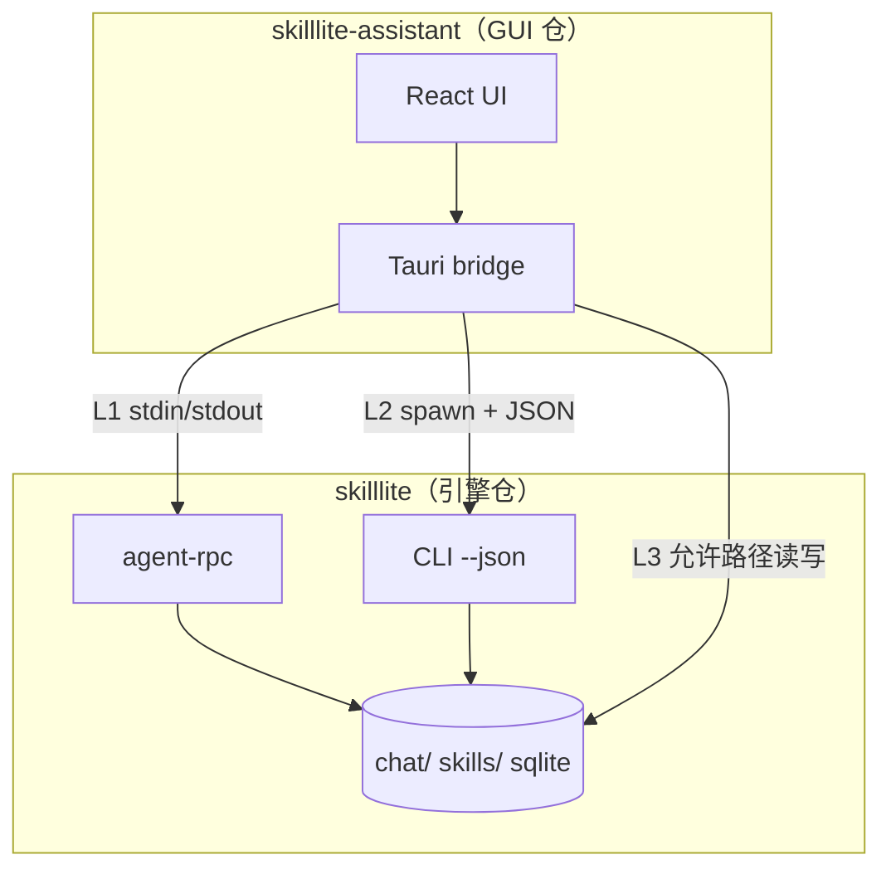

# SkillLite Assistant — 可拆仓架构

> **状态：** 目标架构与迁移计划（2026-05）。说明 `skilllite-assistant` 如何迁入**独立仓库**，而 `skilllite` 继续作为**引擎**（沙箱、MCP、CLI、进化）。
>
> **相关：** [入口 — 桌面](./ENTRYPOINTS-AND-DOMAINS.md#4-desktopskilllite-assistant) · [架构说明](./ARCHITECTURE.md) · [选择路径 — 桌面（可选）](./START_PATHS.md#path-1-desktop)

[English](../en/ASSISTANT-SPLIT-ARCHITECTURE.md)

---

## 1. 目标与非目标

### 目标

| 目标 | 原因 |
|------|------|
| **独立发布节奏** | 桌面安装包（dmg/msi/AppImage）与 PyPI/GitHub 上的 `pip`/CLI 解耦。 |
| **产品边界清晰** | 引擎 = 沙箱 + MCP + `skilllite` 二进制；Assistant = 可选 GUI 分发渠道。 |
| **单一引擎契约** | Assistant 只依赖**已发布**的 `skilllite` 二进制，不再 path 依赖 `skilllite-agent` / `skilllite-evolution`。 |
| **体验不降级** | 流式聊天、执行确认、进化面板、Life Pulse、IDE 三栏 —— 拆仓时功能对齐。 |

### 非目标

- 用解析 `skilllite chat` 终端输出替代 `agent-rpc`。
- 在 Tauri 内再嵌一套完整 Agent 循环（与引擎重复，阻碍拆仓）。
- 让 Assistant 成为第二个「一等引擎入口」，自带沙箱/进化实现。

---

## 2. 现状 vs 目标（摘要）

```text
现状（monorepo，混合）
────────────────────
skilllite-assistant (Tauri)
  ├─ agent-rpc 子进程     ← 聊天（保留）
  ├─ skilllite CLI 子进程 ← gateway、部分 skill、Life Pulse 的 evolution run
  └─ 进程内 Rust crate    ← 进化 UI、followup LLM、运行时安装、
                             技能发现、prompts 写盘（阻碍干净拆仓）

目标（可拆仓）
────────────
skilllite-assistant 独立仓库
  ├─ UI：React + Tauri 命令
  └─ Bridge：仅子进程 → skilllite 二进制（semver 钉扎）

skilllite 引擎仓库
  ├─ skilllite / skilllite-sandbox / MCP
  └─ 稳定机器接口：agent-rpc + CLI --json（+ 可选 desktop-api）
```

---

## 3. 分层集成模型

Assistant **只使用三层集成**；有上层能力时优先上层。

| 层 | 机制 | 用途 |
|----|------|------|
| **L1 — 流式 RPC** | `skilllite agent-rpc`（JSON-Lines） | `agent_chat`、确认/澄清、流式工具事件、多模态附图 |
| **L2 — CLI JSON** | `skilllite <子命令> --json`（stdout） | 进化状态/backlog/pending、运行时探测/安装、技能列表、gateway 相关 |
| **L3 — 文件与环境** | 工作区 `.env`、`chat/`、`skills/` | Prompts 对比 UI、transcript 路径；Assistant 尽量**只读** |



**规则：** 目标态下 Assistant 的 `Cargo.toml` **不得**再出现 `path = "../../skilllite-*"`。

---

## 4. 当前进程内调用映射（迁移 backlog）

| 领域 | 现状位置 | 目标 |
|------|----------|------|
| 主聊天 | `skilllite_bridge/chat.rs` → `agent-rpc` | **保持 L1** |
| 停止聊天 / 确认 | 同上 + `protocol.rs` | **保持 L1** |
| 进化状态面板 | `status.rs` | **L2** `evolution status --json`（**已落地**） |
| 进化 backlog / pending | `backlog.rs`、`pending.rs` | **L2** backlog/pending/proposal-status/confirm/reject `--json`（**已落地**） |
| 手动触发进化 | `trigger.rs` | **L2** `evolution run --json --log-manual-trigger`（**已落地**） |
| Life Pulse `growth_due` | `growth.rs` + `life_pulse.rs` | **L2** status JSON（缓存 30s）；`evolution run` 仍子进程 |
| 猜你想问 | `followup_suggestions.rs`（`LlmClient`） | **L1** 扩展 `agent-rpc` *或* **L2** `skilllite suggest-followup --json` |
| 运行时安装 UI | `desktop_services.rs` | **L2** `runtime probe/provision --json`（**已落地**；CLI 优先 + 回退） |
| 技能列表 / 添加 | `skill_rpc.rs` + 部分 `core` | **L2** `skills list --json`（列表**已落地**）；add/repair 仍为 CLI 子进程 |
| Prompts 对比 / 写入 | `prompt_artifact.rs` + `skilllite-fs` | **L3** CLI 读快照；写入走白名单路径 + `skilllite` |
| 内置技能同步 | `bundled_skills_sync.rs` | **L2** `skilllite skills sync-bundled`（或仅保留 Assistant 资源拷贝） |
| Gateway | `gateway_manager.rs` | **L2** .spawn `skilllite gateway serve`（已是子进程） |

---

## 5. 引擎契约（拆仓前先定）

### 5.1 L1 — `agent-rpc`（基线冻结）

见 `crates/skilllite-agent/src/rpc.rs`。Assistant 依赖：

- 方法：`agent_chat`、`confirm`、`clarify`、`ping`
- 事件：`text_chunk`、`tool_call`、`confirmation_request`、`done`、`error` 等

**版本：** 行协议破坏性变更 → 引擎 **major**；Assistant 声明 `min_skilllite_version`。

### 5.2 L2 — CLI JSON 面（待补/扩展）

与当前 Desktop bridge 对齐的优先子命令：

| 命令 | JSON 输出 | 说明 |
|------|-----------|------|
| `skilllite evolution status --json` | `EvolutionStatusSnapshot` | **已落地**；`--workspace`、`--periodic-anchor-unix` |
| `skilllite evolution backlog --json --hide-closed` | `EvolutionBacklogRowSnapshot[]` | **已落地**（桌面默认过滤） |
| `skilllite evolution pending --json` | 待审核技能列表 | **已落地** |
| `skilllite evolution proposal-status --json` | 单条 backlog | **已落地** |
| `skilllite evolution confirm/reject --json` | 操作结果 | **已落地** |
| `skilllite evolution run --json` | `NodeResult` | **已落地**；`--proposal-id`、`--log-manual-trigger` |
| `skilllite runtime probe --json` | `RuntimeUiSnapshot` | **已落地** |
| `skilllite runtime provision --json` | stderr 进度 JSON 行 + stdout `ProvisionRuntimesResult` | **已落地**；`--python` / `--node` / `--force` |
| `skilllite skills list --json --workspace` | `DesktopSkillSnapshot[]`（对齐 `DesktopSkillInfo`） | **已落地** |
| `skilllite suggest-followup` | `{ "suggestions": [...] }` | 可选 |

**约定：** `--json` 仅在 stdout 输出**一个** JSON 文档；人类可读信息走 stderr。

### 5.3 L3 — 可选薄共享 crate

若 Assistant 需要类型解析但不想链接 `skilllite-agent`：

- 引擎仓发布 **`skilllite-client`**：仅协议类型 + JSON schema，**不含**沙箱/agent 实现。
- Assistant 从 crates.io 依赖 `skilllite-client`；运行时仍 spawn `skilllite` 二进制。

长期避免 path 依赖 `skilllite-core`（`env_keys` 等可迁入 `skilllite-client` 或最小重复）。

---

## 6. 拆仓后的仓库布局

```text
github.com/EXboys/skilllite          github.com/EXboys/skilllite-assistant（示例）
────────────────────────────          ─────────────────────────────────────
crates/skilllite-*                    可选依赖 skilllite-client
skilllite/ 二进制                     skilllite-assistant/
python-sdk/                           src-tauri/（bridge → 仅子进程）
docs/en|zh/                           src/（React）
tutorials/                            release-desktop CI
```

**引擎仓** 在切换后移除 `crates/skilllite-assistant/`（或保留一期 README 指向新仓）。

**Assistant 仓** 钉扎引擎版本，prebuild **不再** `cargo install --path skilllite` 从 monorepo 根目录构建。

---

## 7. 分阶段迁移（先在 monorepo 内完成）

| 阶段 | 范围 | 完成标准 |
|------|------|----------|
| **P0 — 文档** | 本文 + ENTRYPOINTS 目标态 | 团队认同 L1/L2/L3 |
| **P1 — 引擎 JSON** | evolution status、runtime、skills list 等 `--json` | Desktop 可不调用 `skilllite_evolution::` |
| **P2 — Bridge 变薄** | 替换 `evolution_ui/*`、`followup_*`、`desktop_services` 内进程调用 | `Cargo.toml` 去掉 agent/evolution/sandbox path 依赖 |
| **P3 — skilllite-client** | 抽出类型与协议测试 | Assistant 用 crates.io/git 依赖 |
| **P4 — 拆仓库** | 迁移目录、CI、发布；引擎仓留 stub | 两仓 CI 绿 |
| **P5 — 策略** | 更新 `deny.toml`、D1 表述 | 文档与实现一致 |

**P2 未绿之前不要 P4**，否则两个仓库会复制同一份耦合。

### 过渡：`skilllite-services`（可选加速）

若 CLI JSON 膨胀过快，可在**引擎仓**建 `skilllite-services` 供 CLI 与 Assistant 共用逻辑，但拆仓时 Assistant **仍应**通过子进程调用，除非以 `skilllite desktop-serve` 守护进程暴露。为拆仓干净，**优先 L2 CLI JSON**，而非进程内 services。

---

## 8. CI 与发布

| 项 | 引擎仓 | Assistant 仓 |
|----|--------|----------------|
| CI | `cargo test`、沙箱、MCP 冒烟 | `npm test`、Tauri 矩阵、对**钉扎版本** `skilllite` 的契约测试 |
| 发布 | PyPI + GitHub 二进制 | 安装包；脚本捆绑或引导安装引擎 |
| 契约测试 | `--json` 黄金输出 | 解析 fixture 快照 |

---

## 9. 性能说明（拆仓不解决聊天子进程）

| 路径 | 影响 |
|------|------|
| 聊天 | 每轮已起 `agent-rpc` 子进程 —— 不变 |
| 进化状态刷新 | 进程内 → CLI 增加约 50～500ms，需 **5～10s 缓存** |
| 进化 run | Life Pulse 已是子进程 —— 中性 |
| 安装包体积 | 不再静态链接 agent/evolution 后变小 |

---

## 10. 策略变更（D1 → D1′）

**历史（2026-04-20）：** Desktop 为一等入口，允许 `deny.toml` 直接 path 依赖。

**目标（D1′）：** Desktop 为引擎的**可选分发渠道**；P2 完成后不得再作为 `skilllite-agent` / `skilllite-sandbox` / `skilllite-evolution` 的 wrapper。

引擎贡献者优先 **MCP + CLI**；Assistant 贡献者优先 **bridge + UX**，消费引擎发布物。

---

## 11. 待决事项

| 话题 | 选项 |
|------|------|
| 猜你想问 | 扩展 `agent-rpc` vs CLI 子命令 |
| Life Pulse 预检 | 缓存 `evolution status --json` vs 仅 L3 读 `schedule.json` |
| 仓库名 | `skilllite-assistant` vs `skilllite-desktop` |
| 引擎捆绑 | 安装包内置固定 `skilllite` vs 用户自行 `pip install` |

---

## 12. 拆仓前检查清单

- [ ] `src-tauri/Cargo.toml` 无 `skilllite-{agent,sandbox,evolution}` path 依赖
- [ ] 第 4 节能力均由 L1/L2/L3 覆盖
- [ ] Assistant 启动时校验 `min_skilllite_version`
- [ ] 中英文文档仍标 Desktop 为可选
- [ ] 引擎侧 `--json` 契约测试
- [ ] `deny.toml` 与 ARCHITECTURE 中 Desktop 执行链 = 仅子进程
